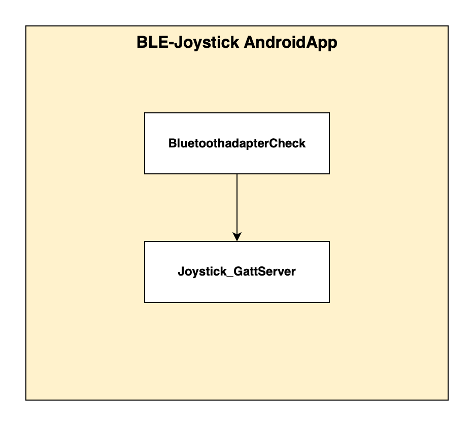

# BLE-Joystick
Bluetooth Low Energy Joystick for the robot Temi. The app connects a virtual Joystick via Bluetooth Low Energy with the robot Temi and let the user to navigate it. 

# **Installation Guide**
The first step is to install ADB on your computer. Follow [this](https://www.xda-developers.com/install-adb-windows-macos-linux) tutorial on how to download and set up ADB on your computer.
If you are using Android Studio is most likely that it is already installed.

# Connect Computer to Robot
Once you have ADB set up on your computer, you can run your code on temi by:
**Step 1:** Make sure you are connected to the same WiFi network as the temi.
**Step 2:** On temi go to settings -> temi Developer Tools -> tap on ADB Port Openning
**Step 3:** On computer - Using the IP address on the top right of temi’s screen you can connect to the robot and test your code. In order to establish a connection with the robot, type following command in Terminal on Mac or Command Prompt on Windows.

```sh
adb connect <IP_ADDRESS>:5555
```

# Installing Applications
Once you have established a connection between your computer and temi, you can install your app using two methods:

**1.** Directly through Android Studio by selecting the "rockchip rk****" and selecting Run.
**2.** By typing the following in the command line:

```sh
adb install [option] PATH_OF_APK
```

# Uninstalling Applications
Once you have established a connection between your computer and temi, you can uninstall your app on temi by typing following command in the terminal:

```sh
abd uninstall [option] PACKAGE_NAME
```

# **Important Functions and Parameters**

# BLE-Joystick

BLE-Joystick consist in two apps, an app for an android device and an app fot TemiOS 

## To perform changes
The Temi app receives the values to control the robot from the Joystick app in the android device. The received data is a byte-Array. The values from the joystick will be separated in the method directionValue() and passed to xSkidJoy and ySkidJoy for the method skidJoy() of the class Robot. It is called in the method taskMaster(). For good driving behavior, it is recommended to leave a buffer of at least 500 ms between each command. To drive forward, the command robot.skidJoy(1,0) is used. To turn left, call the same function with the following input values: robot.skidJoy(0,1). If the values of the x and y axes are zero, the method stopMovement() is called and all the movements are stopped.
The method connectionStateChangedUnsuccessfull() checks if the connection was interrupted and disconnects the device completely, also it checks if the status of the connection is 133 to remove the device, this status means there was a connection problem and stops a reconnection. A status 133 is very common when trying to connect a device and it can have many causes.
For more information follow [this](https://medium.com/@martijn.van.welie/making-android-ble-work-part-2-47a3cdaade07) guide.

## Description of the Structure, Patterns and Division of the Code

The app for TemiOS consists of two classes SelectDeviceActivity and TemiMovement_BLE_Client 
SelectDeviceActivity. SelectDeviceActivity scans for the compatible app with the UUID: 0000FED8-0000-1000-8000-00805F9B34F and it shows the compatible devices in a list. When a device is selected, it sends the device’sinformation to the class TemiMovement_BLE_Client to connect with it and search for Services. 

TemiMovment_BLE_Client looks for the Joystick Service with the UUID: 00001111-0000-1000-8000-00805F9B34FB. The Service includes the characteristic with the UUID: 00002222-0000-1000-8000-00805F9B34FB.


The app for android contains two clases BluetoothadapterCheck and Joystick_GattServer. 
BluetoothadapterCheck checks if the Bluetooth-Module can advertise. If so, then it calls Joystick_GattServer. This class setup the server and starts the advertising and wait for a callback to confirm the connection in onConnectionStateChange(). Then the joystick can be used and the data will be sent with the method changeCharacteristicServer(). 

# **Lookout** 

### _Current Status:_

The apps can maintain a stable connection, exchange and receive data as well as control the robot. But there are still occasional problems in establishing a connection.

### _Open Issues:_

The application sometimes has difficulties to connect and still shows status 133. 
